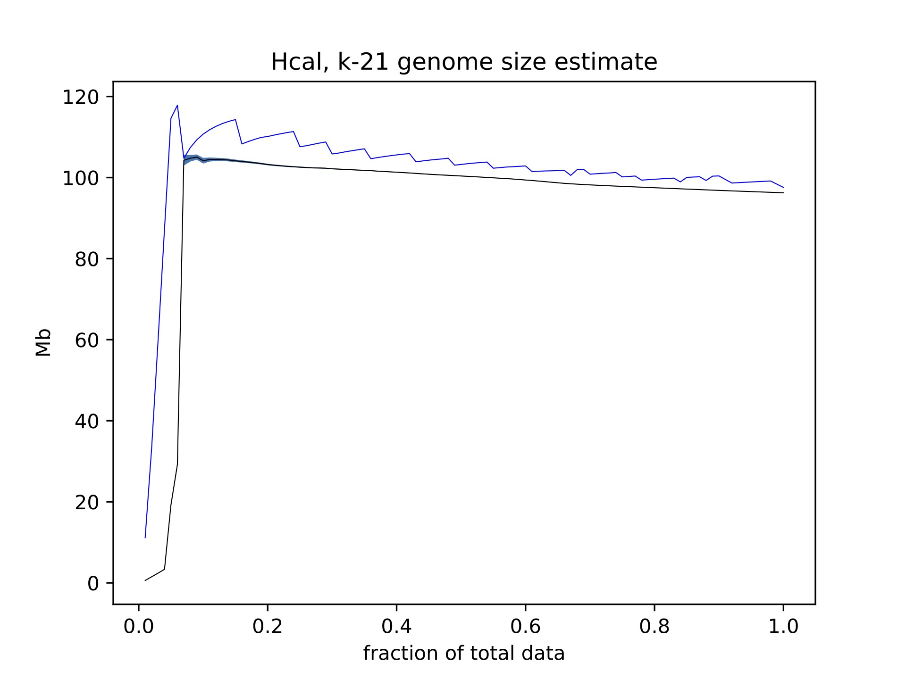

## <a name="started"></a>Getting Started
```sh
# installation
git clone https://github.com/conchoecia/gser
# copy and edit your config file
cp gser/example_config.yaml ./config.yaml
# run gser on your data
snakemake --cores 90 -j1 -r -p --snakefile ../gser/snakefiles/gser
```

## Table of Contents

- [Getting Started](#started)
- [Users' Guide](#uguide)
  - [Installation](#install)
  - [General usage](#general)
  - [Output](#output)

## <a name="uguide"></a>Users' Guide

Gser performs a genome size estimation rarefaction analysis using a k-mer counting approach.

### <a name="install"></a>Installation

Currently the only way to install is to clone the repository and run it as a snakefile:

```sh
# installation
git clone https://github.com/conchoecia/gser
```

There are some required software packages that must be installed in your path to use this script:

- Software requirements:
  - fastqsplitter - https://github.com/LUMC/fastqsplitter 
    - install with conda: https://anaconda.org/bioconda/fastqsplitter
       conda install fastqsplitter
  - bioawk - https://github.com/lh3/bioawk
    - install with conda: https://anaconda.org/bioconda/bioawk
       conda install -c bioconda bioawk
  - ffmpeg - https://www.tecmint.com/install-ffmpeg-in-linux/  
  - genomescope2 - https://github.com/tbenavi1/genomescope2.0
    - can be executed as `genomescope2` or `genomescope.R`

You will also need python 3 with matplotlib, seaborn, and pandas.

### <a name="general"></a>General usage

You must copy the example config file from the github repo and replace the contents with the paths to your reads.

```sh
cp gser/example_config.yaml ./config.yaml
```

After this, run the program with snakemake. To keep the disk footprint low it is important to use the -j1 option. This only allows one job to be run at a time. The jobs are also prioritized to run depth-first to reduce demands on the disk usage.

```sh
snakemake --cores 90 -j1 -r -p --snakefile ../gser/snakefiles/gser
```

### <a name="output"></a>Output

There are three main useful things output by gser at the moment:
  - For each k and each sample, there is a summary table of genome size estimates and other information.
  - There is a figure of genome size estimates based on how proportion of data analyzed.
  - There is a figure of all the parameters of the summary table plotted against one another.




