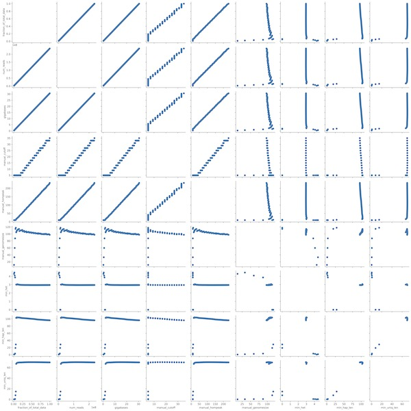

## <a name="started"></a>Getting Started
```sh
# installation
git clone https://github.com/conchoecia/gser
cd gser
make
# copy and edit your config file
cp gser/example_config.yaml ./config.yaml
# run gser on your data
snakemake --cores 90 -r -p --snakefile ../gser/snakefiles/gser
```

## Table of Contents

- [Getting Started](#started)
- [Users' Guide](#uguide)
  - [Installation](#install)
  - [General usage](#general)
  - [Output](#output)
  - [Performance](#performance)


## <a name="uguide"></a>Users' Guide

Gser performs a genome size estimation rarefaction analysis using a k-mer counting approach.

The program takes fastq files of Illumina or PacBio HiFi WGS reads from a single individual,
uses kmc to perform kmer-counting, and then uses both [GenomeScope2](https://github.com/tbenavi1/genomescope2.0)
and a manual coverage method to estimate genome size.

This method is different from simply running GenomeScope2 on the full dataset, because it allows
for the visualization of convergence of the genome size estimate as more data is analyzed. This is beneficial
in helping to decide how much more coverage may be needed to reach convergence for analyzing datasets in which the genome size is not known.

### <a name="install"></a>Installation

Currently the only way to install is to clone the repository and run `make`.
Here, `make` installs a local copy of [GenomeScope2](https://github.com/tbenavi1/genomescope2.0)
and [kmc](https://github.com/refresh-bio/KMC).

When make installs GenomeScope2, it runs this R command `install.packages('.', repos=NULL, type="source")`, which may
not work if other users on your system cannot access your R library. Please raise a github issue if there is a better
solution around this problem.

```sh
# installation
git clone https://github.com/conchoecia/gser
cd gser
make
```

There are some required software packages that must be installed in your path in some other way to use this script:

- Software requirements:
  - fastqsplitter - https://github.com/LUMC/fastqsplitter 
    - install with conda: https://anaconda.org/bioconda/fastqsplitter
       conda install fastqsplitter
  - ffmpeg - https://www.tecmint.com/install-ffmpeg-in-linux/  

You will also need python 3 with matplotlib, seaborn, and pandas.

### <a name="general"></a>General usage

You must copy the example config file from the github repo and replace the contents with the paths to your reads.

```sh
cp gser/example_config.yaml ./config.yaml
```

After this, run the program with snakemake. To keep the disk footprint as low as possible you may use the `-j1` option in the snakemake command. This only allows one job to be run at a time. The jobs are also prioritized to run depth-first to reduce demands on the disk usage.

```sh
snakemake --cores 90 -j1 -r -p --snakefile ../gser/snakefiles/gser
```

### <a name="output"></a>Output

These are the useful things output by gser at the moment:
  - For each k and each sample, there is a summary table of genome size estimates and other information.
    - located in : `gser_analysis/summary_tables/{sample}.{k}.summary_table.tsv`
  - There is a figure of genome size estimates based on how proportion of data analyzed. The black line and the error margins are from genomescope, and the blue line is from the manual genome size estimation.
    - located in : `gser_analysis/genomesize_plots/{sample}.{k}.genomesize.pdf`
  - There is a figure of all the parameters of the summary table plotted against one another.
    - located in : `gser_analysis/genomesize_plots/{sample}.{k}.pairgrid.pdf`
  - The individual histograms of the kmer spectra from different data proportions.
    - located in : `gser_analysis/histos/{sample}/{sample}.{k}.{data_proportion}.histo`
  - The individual histograms of the kmer spectra from different data proportions.
    - located in : `gser_analysis/histos/{sample}/{sample}.{k}.{data_proportion}.histo`
  - An animated .gif of the genomescope spectra images.
    - located in : `gser_analysis/gifs/{sample}.{k}.gif`
  - All of the output files from genomescope2.
    - located in : `gser_analysis/genomescope/{sample}/`


### <a name="example"></a>Example Dataset

This is an example of the output from running gser on the _Hormiphora californensis_
Illumina WGS reads from [Schultz et al. 2021](https://academic.oup.com/g3journal/article/11/11/jkab302/6358137). This
organism is highly heterozygous,
and we knew from previous k-mer spectra that the heterozygous peak would be taller than the heterozygous peak.

These are the contents of the `config.yaml` file used for this example:

```yaml
k-sizes:
  - 21

sample:
  Hcal:
    het_or_hom_peak_larger: "het"
    reads:
      - /path/to/DS184-2_S33_L002_R1_001.trim.fastq.gz
      - /path/to/DS184-2_S33_L002_R2_001.trim.fastq.gz
      - /path/to/DS184_S15_L003_R1_001.trim.fastq.gz
      - /path/to/DS184_S15_L003_R2_001.trim.fastq.gz
      - /path/to/DS185-2_S34_L002_R1_001.trim.fastq.gz
      - /path/to/DS185-2_S34_L002_R2_001.trim.fastq.gz
      - /path/to/DS185_S16_L003_R1_001.trim.fastq.gz
      - /path/to/DS185_S16_L003_R2_001.trim.fastq.gz
      - /path/to/DS201_S23_L003_R1_001.trim.fastq.gz
      - /path/to/DS201_S23_L003_R2_001.trim.fastq.gz
```

To generate the output, we ran `snakemake --cores 90` in a directory containing the `config.yaml` file.
The results show, as expected, that both the manual genome size estimate and GenomeScope2.0 accurately
estimate the genome size, and do so with only a fraction of the input data.




### <a name="output"></a>Performance

This pipeline was originally implemented for jellyfish, but this was replaced with kmc3. With many cores, this results
in less wall time, and in some cases less disk usage than with jellyfish.

These are the results from running the pipeline on the same data with jellyfish and kmc3. Post your run stats
on github issues if available.

| Dataset        | k-mer counter | Gbp of reads | Genome Size | Cov. | snakemake command | CPU time | Wall time | peak RAM | peak disk |
|----------------|---------------|--------------|-------------|------|-------------------|----------|-----------|----------|-----------|
| Comb jellyfish | jellyfish     |        30.58 | 97.56 Mbp   | 313x | `--cores 90`      | 10.8h    | 3.9h      | ??       | ??        |
| Comb jellyfish | kmc3          |        30.58 | 97.56 Mbp   | 313x | `--cores 90`      | 7.3h     | 1.2h      | ??       | ??        |

